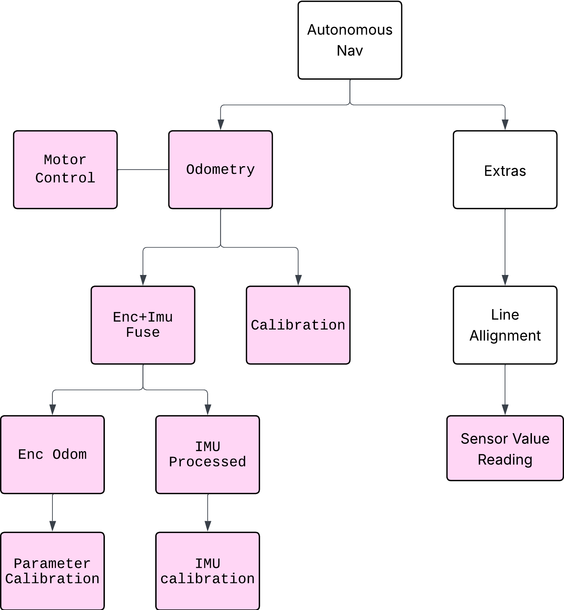

# Autonomous Differential Drive Robot Navigation Stack

This repository contains the step-by-step development of an autonomous navigation stack for a differential drive robot.  
The project starts from collecting encoder and IMU raw data, then gradually builds up to odometry fusion, calibration, and autonomous navigation features.

---

## Table of Contents
- [Overview](#overview)
- [System Architecture](#system-architecture)
- [Development Roadmap](#development-roadmap)
- [Modules](#modules)
  - [Motor Control](#motor-control)
  - [Odometry](#odometry)
    - [Encoder Odometry](#encoder-odometry)
    - [IMU Processing](#imu-processing)
    - [Encoder + IMU Fusion](#encoder--imu-fusion)
    - [Calibration](#calibration)
  - [Extras](#extras)
    - [Line Alignment](#line-alignment)
    - [Sensor Value Reading](#sensor-value-reading)
- [Installation](#installation)
- [Usage](#usage)
- [Hardware Setup](#hardware-setup)
- [Contributing](#contributing)
- [License](#license)

---

## Overview
Brief explanation of what the navigation stack is, its purpose, and the long-term goal of the project.

Also here is some note i found out about esp32 wroom that for me (whose new to esp32) important
- [text](https://randomnerdtutorials.com/esp32-pinout-reference-gpios/)
- [text](https://lastminuteengineers.com/esp32-wroom-32-pinout-reference/)
from this web, i found that some pins cant be used as output especially 34-39

---

## System Architecture
(Insert diagram here – e.g., the block diagram showing motor control, odometry, calibration, extras, etc.)

---

## Development Roadmap
1. **Parameter Calibration** – Extract internal parameters from encoders 
    - For motor and encoder, first use gearbox.ino to get gearbox ratio for each motor (one of the pair of hall sensor in encoder must be put interrupt pin for better reading)
2. **IMU Calibration** – Collect raw IMU data and process bias/noise  
3. **Encoder Odometry** – Implement differential drive odometry  
4. **IMU Processed Data** – Clean and filter IMU data  
5. **Encoder + IMU Fusion** – Fuse encoder odometry and IMU for better localization  
6. **Calibration Module** – Fine-tune and test odometry results  
7. **Motor Control** – Integrate closed-loop control for precise movement  
8. **Line Alignment & Sensor Reading (Extras)** – Add line alignment and other utility features  
9. **Autonomous Navigation** – Full integration of all modules

---

## Modules

### Motor Control
- Description of motor driver, PID, and control strategy.

### Odometry

#### Encoder Odometry
- How raw encoder data is converted to linear and angular displacement.  
- Parameter calibration details.

#### IMU Processing
- How raw IMU data (gyroscope, accelerometer) is processed and filtered.  
- IMU calibration steps.

#### Encoder + IMU Fusion
- Fusion algorithm used (e.g., complementary filter, EKF).  
- Expected improvements over individual sources.

#### Calibration
- Calibration process for both encoder and IMU parameters.  
- Testing procedures.

### Extras

#### Line Alignment
- Method for aligning the robot using line sensors.  
- Example applications.

#### Sensor Value Reading
- Sensor integration for navigation or obstacle avoidance.  
- Data visualization methods.

---

## Installation
Steps for cloning the repo, installing dependencies, and preparing the development environment.

---

## Usage
Examples of running each module step-by-step (e.g., how to test encoder odometry, IMU calibration, etc.).

---

## Hardware Setup
- Differential drive robot hardware specs (motors, encoders, IMU, controller board, sensors, etc.).  
- Wiring diagram and setup instructions.

---

## Contributing
Guidelines for contributing, reporting issues, or suggesting improvements.

---

## License
Specify your license (e.g., MIT, Apache 2.0, GPL).

